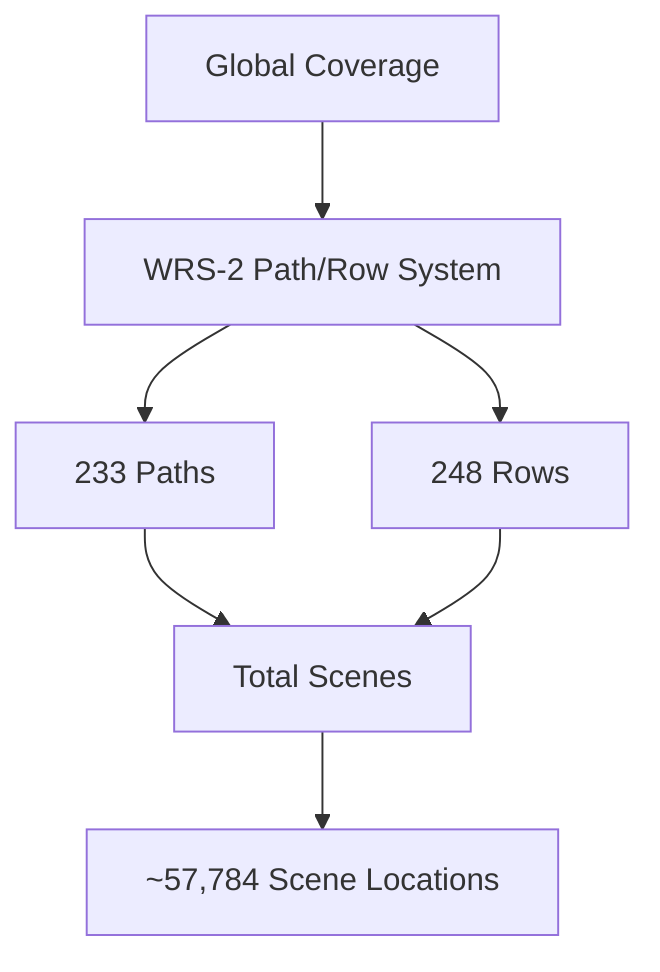

# NASA Landsat Collection

## Overview

This repository contains a comprehensive collection of Landsat satellite imagery from missions 4 through 9. The data is organized by collection and processing level, with standardized metadata following the STAC (SpatioTemporal Asset Catalog) specification.

## 📊 Collections

| Collection | Time Range | Resolution | Processing Levels | Bands |
|------------|------------|------------|-------------------|-------|
| Landsat 4-5 | 1982-2013 | 30m/120m | L1, L2 | MSS, TM |
| Landsat 7 | 1999-2023 | 30m/60m | L1, L2 | ETM+ |
| Landsat 8-9 | 2013-Present | 30m/100m | L1, L2 | OLI, TIRS |

## 🗂️ Repository Structure

```
landsat-collection/
├── landsat_4_5/
│   ├── scenes.parquet
│   └── metadata/
├── landsat_7/
│   ├── scenes.parquet
│   └── metadata/
├── landsat_8_9/
│   ├── scenes.parquet
│   └── metadata/
└── stac/
    ├── catalog.json
    ├── landsat-4-5.json
    ├── landsat-7.json
    └── landsat-8-9.json
```

## 📝 Data Format

### Scene Metadata (Parquet Schema)
```sql
CREATE TABLE scenes (
    scene_id STRING,
    spacecraft STRING,
    path INTEGER,
    row INTEGER,
    acquisition_date TIMESTAMP,
    cloud_cover FLOAT,
    sun_elevation FLOAT,
    sun_azimuth FLOAT,
    processing_level STRING,
    geometric_rmse FLOAT,
    download_url STRING
);
```

### STAC Metadata
```json
{
  "type": "Collection",
  "stac_version": "1.0.0",
  "id": "landsat-8-9",
  "description": "Landsat 8-9 Collection 2 Level-2 scenes",
  "license": "PDDL-1.0",
  "extent": {
    "spatial": {"bbox": [[-180, -90, 180, 90]]},
    "temporal": {"interval": [["2013-02-11", null]]}
  }
}
```

## 📈 Collection Statistics

| Metric | Landsat 4-5 | Landsat 7 | Landsat 8-9 |
|--------|-------------|------------|-------------|
| Total Scenes | 1.2M | 2.5M | 3.1M |
| Daily Scenes | ~250 | ~450 | ~740 |
| Coverage | Global | Global | Global |
| Revisit | 16 days | 16 days | 8 days |

## 🛠️ Usage Examples

### Python with Pandas
```python
import pandas as pd

# Load scene metadata
scenes = pd.read_parquet('landsat_8_9/scenes.parquet')

# Filter by cloud cover and date
filtered = scenes[
    (scenes.cloud_cover < 20) &
    (scenes.acquisition_date > '2023-01-01')
]
```

### Python with STAC
```python
from pystac_client import Client

# Connect to STAC catalog
catalog = Client.open('stac/catalog.json')

# Search for scenes
scenes = catalog.search(
    collections=['landsat-8-9'],
    bbox=[-122.5, 37.5, -122.0, 38.0],
    datetime='2023-01-01/2023-12-31'
)
```

## 🌍 Coverage Map



## 📊 Quality Metrics

| Processing Level | Geometric Accuracy | Radiometric Accuracy | Cloud Detection |
|-----------------|-------------------|---------------------|-----------------|
| Level-1 | < 12m RMSE | 3% uncertainty | 88% accuracy |
| Level-2 | < 12m RMSE | 5% uncertainty | 92% accuracy |

## 🔄 Update Schedule

- Landsat 8-9: Near real-time (within 24 hours)
- Historical data: Continuous reprocessing
- Metadata: Daily updates
- STAC catalog: Hourly updates

## 📦 Data Access

### Direct Download
- Base URL: `https://landsatlook.usgs.gov/data/`
- Authentication: Required (EarthData Login)
- Rate Limits: 10 concurrent downloads

### Cloud Optimized GeoTIFF
- AWS: `s3://usgs-landsat`
- Google Cloud: `gs://gcp-public-data-landsat`
- Azure: `https://landsateuwest.blob.core.windows.net`

## 🛠️ Tools & Libraries

Recommended software for working with Landsat data:
- [landsat-util](https://github.com/developmentseed/landsat-util)
- [rio-toa](https://github.com/mapbox/rio-toa)
- [sat-search](https://github.com/sat-utils/sat-search)

## 📄 License

This data is released under the PDDL-1.0 license.

## 🤝 Contributing

We welcome contributions! Please see [CONTRIBUTING.md](CONTRIBUTING.md) for guidelines.

## 📞 Contact

- Email: landsat@usgs.gov
- Website: https://www.usgs.gov/landsat
- Twitter: @USGSLandsat

## 🔗 Related Resources

- [Landsat Science](https://landsat.gsfc.nasa.gov/)
- [USGS Earth Explorer](https://earthexplorer.usgs.gov/)
- [Collection 2 Documentation](https://www.usgs.gov/landsat-missions/landsat-collection-2) 