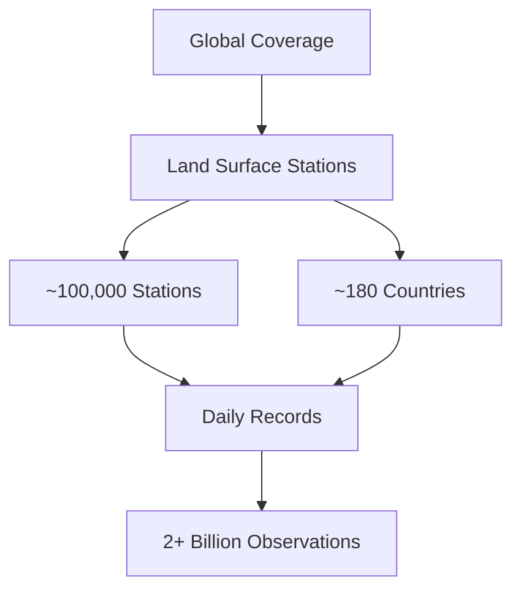

# NOAA Global Historical Climatology Network (GHCN)

## Overview

The Global Historical Climatology Network (GHCN) is an integrated database of climate summaries from land surface stations across the globe. The data is compiled from various sources including more than 20 different input datasets, some of which were created more than 50 years ago.

## 📊 Data Coverage

- **Temporal Coverage**: 1763-Present
- **Spatial Coverage**: Global
- **Number of Stations**: ~100,000 stations
- **Update Frequency**: Monthly

## 🗂️ Repository Structure

```
ghcn/
├── daily/
│   ├── by_year/
│   │   ├── 2024.csv
│   │   ├── 2023.csv
│   │   └── ...
│   └── metadata/
│       ├── stations.txt
│       └── countries.txt
├── monthly/
│   ├── data/
│   │   ├── temperature.csv
│   │   ├── precipitation.csv
│   │   └── pressure.csv
│   └── metadata/
└── quality/
    ├── qc_logs/
    └── flags.txt
```

## 📝 Data Format

### Daily Data Format
```csv
ID,YEAR,MONTH,DAY,ELEMENT,VALUE,M-FLAG,Q-FLAG,S-FLAG
USC00011084,2024,1,1,TMAX,289,,5,0
USC00011084,2024,1,1,TMIN,133,,5,0
USC00011084,2024,1,1,PRCP,0,,5,0
```

### Station Metadata Format
```csv
ID,LATITUDE,LONGITUDE,ELEVATION,STATE,NAME,GSN_FLAG,CRN_FLAG,WMO_ID
USC00011084,33.9505,-87.3766,252.1,AL,ADDISON 2 NW,,,
```

## 🌡️ Climate Elements

| Code | Description | Units | Precision |
|------|-------------|-------|-----------|
| TMAX | Maximum temperature | Celsius | 0.1 |
| TMIN | Minimum temperature | Celsius | 0.1 |
| PRCP | Precipitation | mm | 0.1 |
| SNOW | Snowfall | mm | 1.0 |
| SNWD | Snow depth | mm | 1.0 |

## 🔍 Quality Control Flags

| Flag | Description |
|------|-------------|
| M | Measurement flag |
| Q | Quality flag |
| S | Source flag |

## 📊 Data Statistics

- **Total Records**: > 2 billion observations
- **Data Volume**: ~600GB compressed
- **File Format**: CSV with quality control flags
- **Missing Data**: Coded as -9999

## 🛠️ Usage Examples

### Python Example
```python
import pandas as pd

# Read daily data
df = pd.read_csv('daily/by_year/2024.csv')

# Filter for temperature data
temp_data = df[df['ELEMENT'].isin(['TMAX', 'TMIN'])]

# Convert to Celsius
temp_data['VALUE'] = temp_data['VALUE'] / 10.0
```

### R Example
```r
library(tidyverse)

# Read station metadata
stations <- read.csv('metadata/stations.txt')

# Plot station locations
ggplot(stations, aes(x=LONGITUDE, y=LATITUDE)) +
  geom_point(alpha=0.5) +
  coord_map()
```

## 🌍 Global Coverage Map



## 📈 Data Quality

- Rigorous quality control procedures
- Multiple levels of quality assurance
- Automated and manual verification
- Peer-reviewed methodology

## 🔄 Update Schedule

- Daily data: 24-48 hour delay
- Monthly data: ~5th of each month
- Annual updates: February
- Metadata: As needed

## 📦 Data Access

### Direct Download
- FTP: `ftp://ftp.ncdc.noaa.gov/pub/data/ghcn`
- HTTP: `https://www1.ncdc.noaa.gov/pub/data/ghcn`
- API: `https://www.ncdc.noaa.gov/cdo-web/api/v2`

### Cloud Access
- AWS: `s3://noaa-ghcn-pds`
- Google Cloud: `gs://public-datasets-noaa-ghcn`

## 🛠️ Tools & Resources

- [GHCN-Daily Quality Assurance](https://www.ncdc.noaa.gov/ghcn-daily-description)
- [GHCN-Monthly Quality Control](https://www.ncdc.noaa.gov/ghcnm/v4-qc-system)
- [CDO Web Services](https://www.ncdc.noaa.gov/cdo-web/)

## 📄 License

This data is released under the [U.S. Government Work](https://www.usa.gov/government-works) license.

## 🤝 Contributing

For questions about the data or to report issues:
- Email: ncdc.ghcn@noaa.gov
- Issue Tracker: [GHCN Issues](https://www.ncdc.noaa.gov/ghcn-daily-description)

## 📞 Contact

- Email: ncdc.ghcn@noaa.gov
- Website: https://www.ncdc.noaa.gov/data-access/land-based-station-data/land-based-datasets/global-historical-climatology-network-ghcn
- Twitter: @NOAA

## 🔗 Related Resources

- [NOAA Climate Data Online](https://www.ncdc.noaa.gov/cdo-web/)
- [World Meteorological Organization](https://public.wmo.int/)
- [GHCN Publications](https://www.ncdc.noaa.gov/ghcn-daily-references) 