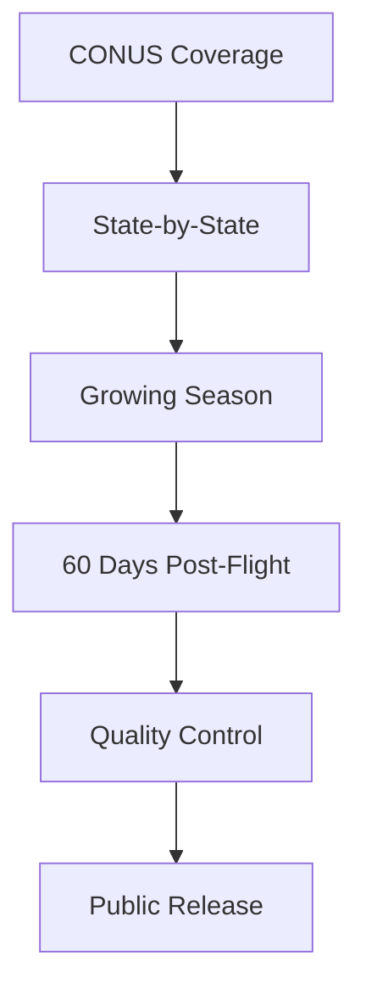

# National Agriculture Imagery Program (NAIP)

## Overview

The National Agriculture Imagery Program (NAIP) acquires aerial imagery during the agricultural growing seasons in the continental United States. NAIP is administered by the USDA's Farm Service Agency (FSA) and is available at a one-meter ground sample distance (GSD).

## 📊 Data Specifications

| Parameter | Value |
|-----------|-------|
| Resolution | 1 meter |
| Bands | 4 (RGB + NIR) |
| Format | GeoTIFF/COG |
| Projection | UTM/NAD83 |
| Accuracy | ±6 meters |
| Coverage | CONUS |

## 🗂️ Repository Structure

```
naip/
├── states/
│   ├── al/
│   │   ├── 2022/
│   │   │   ├── tiles/
│   │   │   └── metadata/
│   │   └── 2020/
│   ├── ca/
│   │   ├── 2022/
│   │   └── 2020/
│   └── ...
├── indices/
│   ├── tiles.geojson
│   └── state_coverage.json
└── stac/
    ├── catalog.json
    └── collection.json
```

## 📝 Data Format

NAIP imagery is delivered as compressed GeoTIFF files with the following specifications:

```
Format: GeoTIFF/COG
Compression: JPEG
Bit Depth: 8-bit
Bands: Red, Green, Blue, Near Infrared
No Data Value: 0
Internal Tiling: 512x512
Overview Levels: 2, 4, 8, 16
```

## 🌎 Coverage Map



## 📊 Data Statistics

- Tile Size: 3.75' x 3.75' quarter quadrangles
- File Size: ~200MB per tile
- Annual Coverage: ~50% of CONUS
- Historical Data: 2003-present
- Update Cycle: 2-3 years per state

## 🛠️ Usage Examples

### Python with rasterio
```python
import rasterio
import numpy as np

# Read NAIP image
with rasterio.open('naip_tile.tif') as src:
    # Read all bands
    red, green, blue, nir = src.read()
    
    # Calculate NDVI
    ndvi = (nir - red) / (nir + red)
    
    # Get metadata
    transform = src.transform
    crs = src.crs
```

### GDAL Command Line
```bash
# Create overviews
gdaladdo -r average naip_tile.tif 2 4 8 16

# Convert to Cloud Optimized GeoTIFF
gdal_translate naip_tile.tif cog.tif \
    -co COMPRESS=JPEG \
    -co TILED=YES \
    -co COPY_SRC_OVERVIEWS=YES \
    -co BLOCKXSIZE=512 \
    -co BLOCKYSIZE=512
```

## 🔄 Acquisition Schedule

| Region | Typical Acquisition |
|--------|-------------------|
| Southeast | April-June |
| Midwest | June-August |
| Northeast | July-September |
| West | July-September |

## 📦 Data Access

### Cloud Access
- AWS: `s3://usda-naip`
- Google Cloud: `gs://naip`
- Azure: `https://naipeuwest.blob.core.windows.net`

### Direct Download
- USDA Geospatial Data Gateway
- EarthExplorer
- Web Coverage Service (WCS)

## 🛠️ Tools & Resources

- [FSA APFO Imagery Navigator](https://naip-usdaonline.hub.arcgis.com/)
- [GDAL](https://gdal.org/)
- [COG Validator](https://github.com/rasterio/rio-cogeo)

## 📄 License

This data is released under the [U.S. Government Work](https://www.usa.gov/government-works) license.

## 📞 Contact

- Email: apfo.sales@slc.usda.gov
- Website: https://www.fsa.usda.gov/programs-and-services/aerial-photography/
- Phone: 801-844-2922

## 🔗 Related Resources

- [USDA Aerial Photography Field Office](https://www.fsa.usda.gov/programs-and-services/aerial-photography/)
- [NAIP Imagery Info Sheet](https://www.fsa.usda.gov/Assets/USDA-FSA-Public/usdafiles/APFO/naip_info_sheet_2020.pdf)
- [Status Maps](https://www.fsa.usda.gov/programs-and-services/aerial-photography/status-maps/) 